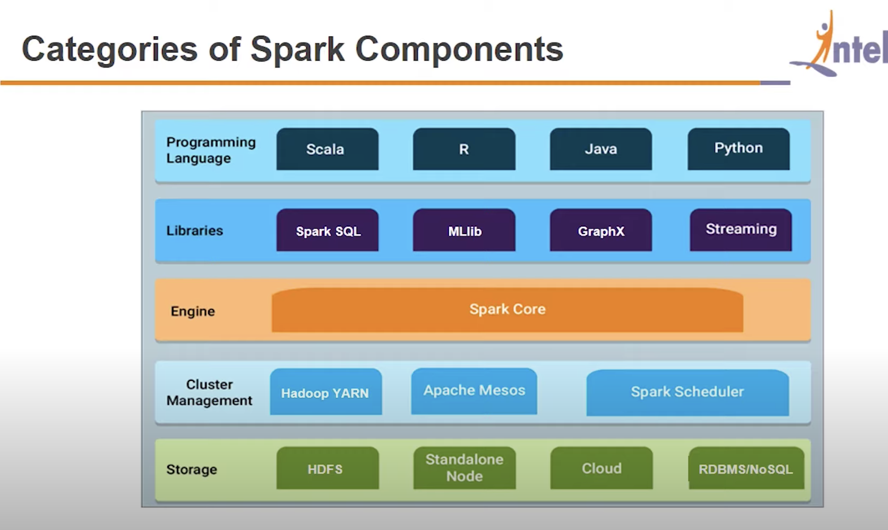
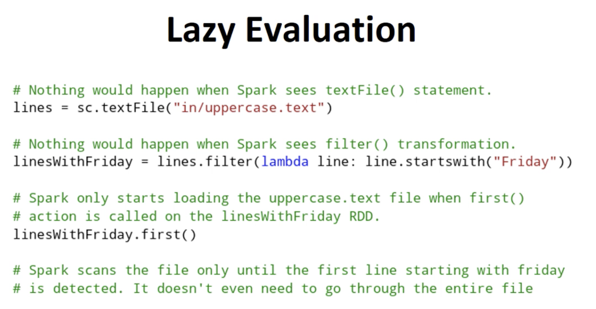
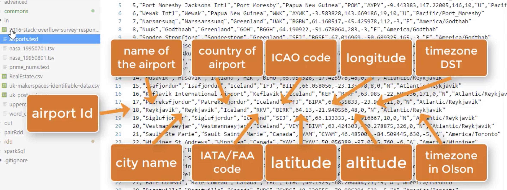

# Pyspark and DataLake notes

These are a list of notes, learning materials and resources for learning Pyspark, Tableu and other datalake technologies and terms.   

## Learning Path


    
| Topics | 
|-------|
| [pyspark](#Pyspark) |
| [RDD](#RDD) |
| [Airflow](#Airflow) | 
| Tableu | 
| Hive Tables |
| [Data Engineer](#Data-Engineer)|
|[Useful Links](#Useful-Links)|
|[Notes](#Notes)|


## Pyspark
    


- Apache Spark is written in Scala programming language
	- Py4j Allows apache to create the python plugin
- Using PySpark, you can work with **RDDs** in Python programming language
- Pyspark runs on disributed computers  


## Install on Linux  

- Installing via direct download, untar to location
- Set spark home, python type and path variables  
  
```
spark-submit myprogram.py
```  
    
- Two output files because of two cores used.  


# RDD
  
Resilient Distributed Dataset (RDD)    
  
**"RDD IS A CAPSULATION AROUND A LARGE DATASET"**  
    
- The most important concept
- RDD can contain **any type of object** including user defined classes.
- In Spark **all work** is 
	- Creating RDDs
	- Transforming RDDs
	- Applying operations to RDDs to compute results    

- Spark shards and distributes your data under the hood 
	- It parellelizes the operations you perform on them . 

- RDDs are distributed  
	- broken into multiple pieces called **partitions** 
	- These are divided accross  **clusters**  
	- 8 partitions could run on 8 nodes
	- Auto done on spark, and **immutable** don't change to keep them resilient.  
  
  
  
Spark only really starts computation (loading etc) once it sees an action and not a transformation.  


RDDs have two operations: 

- **Transforamtions**  
	- Applies a function to RDD and returns a new one.
	- i.e. filter an RDD to produce a subset RDD
- **Actions**  
	- Compute a result based on an RDD
	- i.e. First which returns the first element in an RDD

### Filter Transformation example  

```python
lines           = sc.textFile("in/Uppercase.txt")
linesWithFriday = lines.filter(lambda line: "Friday" in line)
```

  
### First Action example  

```python
lines           = sc.textFile("in/Uppercase.txt")
firstLine       = lines.first()
```  
    

## General Spark Flow with RDDs  
  
1. Generate **initial RDDS** from external Data.  
2. Apply **transformations** 
3. Launch **actions**
  
  
    
## Creating RDDs  
  
Simplest method is : 
- Take existing collection 
- Pass into sparkContext's `parallelize` method  
    
**Parallelise operation**  

```python  
inputIntegers = list(range(1,6))
integerRdd   = sc.parallelize(inputIntegers)
```          

**SparkContext**   represents a connection to a computer cluster.  

    
- All elements will be copied into a **distributed dataset**    
- which can be operated on in parallel  
	- handy for small datasets 
- **not practical** for working on large datasets (because we will need to slice/dice em first)  
  

    
A better way is to read from **external storage**  
    
**Read from textfile**  

```python
sc = SparkContext("local", "textfile") 
lines = sc.textFile("in/uppercase.txt")
```
    
More realistic approach is using **HDFS** or db integration with **JDBC**, **CASSANDRA**, **ELASTISEARCH**  
    
## Filter Transformation


- returns new RDD original remains unchanged
- Returns elements selected which pass **filter function**    
- Can be used to remove invalid rows or clean up 

```python
cleanedLines = lines.filter(lambda line: line.strip())
```  
  

## Map transformation  

- Applies a function to each element in the RDD  
- Result being the new value of each applied  
- it can be used to make `http requests` to each URL in our input RDD, or calculate the square root of each number.  
      

**Make http request for each input url**    

```python  
URLs = sc.textFile("in/urls.text")
URLs.map(makeHttpRequest)
```
  
**Note** Output can be a new type.  
  
```python 
lines   = sc.textFile("in/uppercase.text")   # string 
lengths = lines.map(lambda line: len(line))  # int  
```  
  
## Problem Example    
  
- This is from the tutorial folder, only available to me.  
  
 
 
- Parse input data, find airports from usa only and return their name, city  
- sample out looks like `"blah airport", "blah city"`

  
```python
import sys
sys.path.insert(0, '.') # Adding root directory to current path
from pyspark import SparkContext, SparkConf
from commons.Utils import Utils  # Comma delimiter class

def splitComma(line: str):
    splits = Utils.COMMA_DELIMITER.split(line)
    return "{}, {}".format(splits[1], splits[2])

if __name__ == "__main__":
    conf = SparkConf().setAppName("airports").setMaster("local[2]")
    sc = SparkContext(conf = conf)

    airports = sc.textFile("in/airports.text")   ## Load input
    airportsInUSA = airports.filter(lambda line : Utils.COMMA_DELIMITER.split(line)[3] == "\"United States\"")

    airportsNameAndCityNames = airportsInUSA.map(splitComma)
    airportsNameAndCityNames.saveAsTextFile("out/airports_in_usa.text")
```  

## breakdown
    
`conf = SparkConf().setAppName("airports").setMaster("local[*]")`
- This line sets the applicationname, in conf object, used a lot in the `sparkweb ui`  
- `.setMaster("local[2]")` sets the master node URL and number of nodes.   
  
`sc = SparkContext(conf = conf)`  
- **Main entry point** 
- Creates the sparkcontext object 

```
 airportsInUSA = airports.filter(lambda line : Utils.COMMA_DELIMITER.split(line)[3] == "\"United States\"")
```
- Filter the string
	- Takes function as argument 
	- the function takes a string as argument
	- Applies to each value 
	- Delimiter gets all commas, except those in `","`  
	- `(line)[3]` means taking the fourth split  

To run, input `spark-submit path.py`

## Popular transformations

- filter
- map  
  

## Popular Set transformations  
  
- Run on Single RDD 
	- sample
	- Distinct
- Run on two or more RDDs
	- **Union**
		- merges
	- **Intersection**
		- identifies common elements and returns them deduped
	- **Subtract**
		- A - B returns A values that are not in B
	- **Cartesian product**
		- returns all possible pairs of A and B 

## Popular Actions  
  
- **Collect**
	- Retrieves entire RDD and returns 
- **count**
	- count unique elements
- **countByValue**
	- 
- **Take**
	- takes n element from rdd i.e. `take(3)` returns first three roles
- **saveAsTextFile**
	- writes to HDFS or amazon s3
- **reduce**
	- returns a single value, like aggregating 


## REGEX Tips  

#### Split by tab  
  
`line.split("\t")`  

#### Filter empty using boolean  
    
- lambda returns true/false for each  
- filter just keeps the true values

```python
validNumbers = numbers.filter(lambda: number: number)
```

## Airflow  


**DAG** - Directed Acyclic Graph  
    

- Workflows 
- graphs 
- monitoring workflows (workflow manager like UCD etc )  
- Great for ETL 


1. Write a CSV file to a platform data container.

2. Convert the CSV file into a Parquet table.

3. Run SQL queries on the data in Parquet table.  
  
  
## Useful Links

  
[pyspark](https://www.youtube.com/watch?v=XrpSRCwISdk&ab_channel=Databricks ) 

[DataScience roles](https://www.jeffersonfrank.com/insights/aws-big-data-roles?utm_source=DSMN8&utm_medium=LinkedIn)
  
[SAS](https://www.sas.com/en_gb/insights/data-management/what-is-etl.html)  
      


## Data Engineer
  

Once the Data Architect has presented their vision for the cloud palace in which your data will be stored, the Data Engineer steps in to build it.
  
These specialist professionals use programming languages to construct and maintain the proposed framework and enable data to be searched and retrieved efficiently.
  
It’s super technical work that involves not only building the data warehouse, but constantly revisiting and improving it to ensure maximum efficiency. A Data Engineer will also create and document processes, outlining how other data professionals in the team will harvest, authenticate, and model the information.
  
Before big data truly took off, Data Architect and Data Engineer was often a single role, with data pros both designing and constructing the systems.
  
In the past few years, given the increasing popularity and complexity of analytical solutions—and the sheer quantity of data we’re amassing—Data Engineer has emerged as a standalone position.
  
Your Data Engineer should have a solid background in data warehousing, and have experience with big data technologies and languages like Python, R, SQL, and Scala, SQL and NoSQL databases, and the AWS Cloud.
  
A good understanding of big data platforms like Hadoop, Spark, Kafta, and visualization tools like Tableau will also come in handy.
  
## Notes

- No **dataswamps**
- Dynamic **DAGs **with Airflow
- I care about **data lifecycle**, managing transformation, batch jobs, task driven 
- upstream,downstream dependencies pipeline 
- **siem** BIG BIG DATA
- Fortnightly demos to cover scale improvements, reduction etc
- *map reduce* for hadoop data file system 
	- sharding data for processing. 

- AWS depending on use case, can be anything from file gateway to kinesis and datasync.
	- kinesis for streaming
	- filegateway for bulk transfer 
	- redshift for data warehousing
	- Athena for dat query using sql
	- Elasticseach (kibana and logstash)

## Datamovment 
	- **MSK for kafka** (use kafka apis to move and stream) 
	- Firehose
## Datalake
	- AWS datalake formation (beanstalk for datalake)


# BigData   

The role is to do with ingesting data and bringing data on to the AWS platform It involves 

- loading data  
- ETL transformation  
  
so they are keen to bring someone in with **big data** and **transformation** experience. 
 
This individual will be liaising with the **business** and testing teams **Python/Pyspark** experience is important AWS experience is also key SQL and **Airflow** are useful to have 

Infrastructure or server experience is not necessary  
  
## Answers  
  

- Create workflows for data ingestion using Pyspark  
- I've worked with various AWS ingestion methods such as: 
	- Transfer local data to SMB share presented by `file gateway`, it then stores in an s3 bucket
	- aws `datasync` to transfer in bulk 
	- `SFTP` clients to transfer data using   

- use Custom Grafana Dashboards or data studio to visualise data transfer process  


## AWS Options  
  
# ETL   

- Extract, transform, load  
- Large experience from working with map reduce such as kafka, sharding ..
- Datascience projects using pandas, DS pipelines  
 
**Requirements**  
  
- Failures
- monitoring 
- Dependencies   
- Scalability  
- Deployment


  