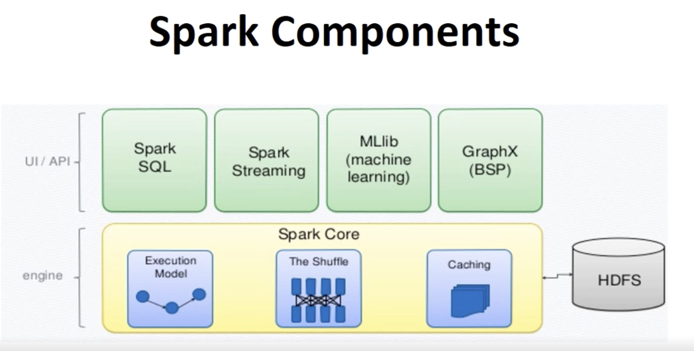

# ETL, Pyspark & DataLake notes

These are a list of notes, learning materials and resources for learning Pyspark, Tableu and other datalake technologies and terms.   

## Navigation

    
| Intro| [Intro, Notes and ETL](#Intro) |
|-------| -------|  
  

| **PYSPARK**|  | | 
|-------|-------|-------|
| [DataFrames](content/DataFrames/README.md)|[RDD](content/rdd/README.md)  |[Spark High Level](#Spark-High-Level) |  

  

| **TOOLS**             |    | |  |
|-------|-------|-------|-----|
| [AIRFLOW](#Airflow)|   [TABLEU](#TABLEU) |   [Hive Tables](#Hive-Tables) |   [SAP](#SAP)


| **General** |   | |  |   
|-------|-------|-------|-------|  
| [Data Engineer](#Data-Engineer)|[Useful Links](#Useful-Links)| [Notes](#Notes)|  [REGEX Tips](#REGEX-Tips) |  
  


## Intro
    

## Quick Notes
  
- Get accumulator value using 
- Get rdd values using collect or map
```python
rdd.map(lambda x: (x[0], x[2], x[4])) # get first, thrid and fifth element of each
```
  
- Make comma delimiter utils function
  
- Run Pyspark in jupytern notebooks  
  
Add the following to `~/.zshrc`  


```
export PYSPARK_DRIVER_PYTHON=jupyter
export PYSPARK_DRIVER_PYTHON_OPTS='notebook'
```

    
## ETL   
   
Extract, Transform and Load

- OLTP Online Transaction Processing
- OLAP Online Analytics Processing  
 
Challenges  

- Nightly batches? 
- Incremental loading (i.e. the delta)  
- Loading millions of records takes hours  
- OLTP have multiple disparate sources 
- Record changing overtime and relationships  

    
**Dat is precious** ensure that there is no way for records to be lost.  


### High level plan  
 

1. Determine initial and end state data, **required end state**.  
2. Determine Source
3. Plan **Data Extraction** , **cleansing** and **transformation** rules.  
4. Load **data attributes** prior to activity i.e. schema, size to perform checksum. 
5. Manage Disaster recover, and disaster disaster recovery scenarios  
6. Learn Data Architecture Diagrams - produce them, work towards them 
7. Validate all transformations 
8. Business Rules to be validated both programatically and with peers.  
9. Sequential transformations are a risk, create processes to simplify and manage. Think deeply if you have to... 
10. Manage third party failures and upstream dependencies 
  
### Adam's MANDATORY Approach  
  
- Document `initial state`  
- Validate/agree `final state`
- Generate `libs` to create delta between `initial` and `final`  
- Generate `libs` for cleaning, missing, drop etc  
- Generate `libs` for measuring metrics of jobs, to document improvements/failures  
- Create Audit logs for all ETL jobs performed   
- Generate ETL `unit tests` including failure scenarios  
- Manage ETL `signalling`, `checking` and `notification steps` i.e. a job to ensure the jobs are running and communicate them.  
- programatically generate data-job relationships and produce graphs.  
- Random `logic validator` for transactions to be run accross snapshot of transformation.   
- Create `alerts` and `logic` for external failures, i.e. an expected data load didn't arrive.      


<br/>
<br/>
<br/>
<br/>
<br/>
<br/>

## Spark High Level
  
  
  
  
- Spark streaming uses API like spark core  
- graphx extends RDD with properties for each vertice and edge.    
  

## Pyspark
    


- Apache Spark is written in Scala programming language
	- Py4j Allows apache to create the python plugin
- Using PySpark, you can work with **RDDs** in Python programming language
- Pyspark runs on disributed computers  


## Install on Linux  

- Installing via direct download, untar to location
- Set spark home, python type and path variables  
  
```
spark-submit myprogram.py
```  
    
- Two output files because of two cores used.    
  


  
## REGEX Tips
  
   
[Navigation](#Navigation)  
    
  


#### Split by tab  
  
`line.split("\t")`  

#### Filter empty using boolean  
    
- lambda returns true/false for each  
- filter just keeps the true values

```python
validNumbers = numbers.filter(lambda: number: number)
```
  


  

## Airflow  


**DAG** - Directed Acyclic Graph  
    

- Workflows 
- graphs 
- monitoring workflows (workflow manager like UCD etc )  
- Great for ETL 


1. Write a CSV file to a platform data container.

2. Convert the CSV file into a Parquet table.

3. Run SQL queries on the data in Parquet table.  
  
  
## Useful Links

  
[pyspark](https://www.youtube.com/watch?v=XrpSRCwISdk&ab_channel=Databricks ) 

[DataScience roles](https://www.jeffersonfrank.com/insights/aws-big-data-roles?utm_source=DSMN8&utm_medium=LinkedIn)
  
[SAS](https://www.sas.com/en_gb/insights/data-management/what-is-etl.html)  
      


## Data Engineer
  

Once the Data Architect has presented their vision for the cloud palace in which your data will be stored, the Data Engineer steps in to build it.
  
These specialist professionals use programming languages to construct and maintain the proposed framework and enable data to be searched and retrieved efficiently.
  
It’s super technical work that involves not only building the data warehouse, but constantly revisiting and improving it to ensure maximum efficiency. A Data Engineer will also create and document processes, outlining how other data professionals in the team will harvest, authenticate, and model the information.
  
Before big data truly took off, Data Architect and Data Engineer was often a single role, with data pros both designing and constructing the systems.
  
In the past few years, given the increasing popularity and complexity of analytical solutions—and the sheer quantity of data we’re amassing—Data Engineer has emerged as a standalone position.
  
Your Data Engineer should have a solid background in data warehousing, and have experience with big data technologies and languages like Python, R, SQL, and Scala, SQL and NoSQL databases, and the AWS Cloud.
  
A good understanding of big data platforms like Hadoop, Spark, Kafta, and visualization tools like Tableau will also come in handy.
  
## Notes

- No **dataswamps**
- Dynamic **DAGs **with Airflow
- I care about **data lifecycle**, managing transformation, batch jobs, task driven 
- upstream,downstream dependencies pipeline 
- **siem** BIG BIG DATA
- Fortnightly demos to cover scale improvements, reduction etc
- *map reduce* for hadoop data file system 
	- sharding data for processing. 

- AWS depending on use case, can be anything from file gateway to kinesis and datasync.
	- kinesis for streaming
	- filegateway for bulk transfer 
	- redshift for data warehousing
	- Athena for dat query using sql
	- Elasticseach (kibana and logstash)

## Datamovment 
	- **MSK for kafka** (use kafka apis to move and stream) 
	- Firehose
## Datalake
	- AWS datalake formation (beanstalk for datalake)


# BigData   

The role is to do with ingesting data and bringing data on to the AWS platform It involves 

- loading data  
- ETL transformation  
  
so they are keen to bring someone in with **big data** and **transformation** experience. 
 
This individual will be liaising with the **business** and testing teams **Python/Pyspark** experience is important AWS experience is also key SQL and **Airflow** are useful to have 

Infrastructure or server experience is not necessary  
  
## Answers  
  

- Create workflows for data ingestion using Pyspark  
- I've worked with various AWS ingestion methods such as: 
	- Transfer local data to SMB share presented by `file gateway`, it then stores in an s3 bucket
	- aws `datasync` to transfer in bulk 
	- `SFTP` clients to transfer data using   

- use Custom Grafana Dashboards or data studio to visualise data transfer process  


## AWS Options  
  
# ETL   

- Extract, transform, load  
- Large experience from working with map reduce such as kafka, sharding ..
- Datascience projects using pandas, DS pipelines  
 
**Requirements**  
  
- Failures
- monitoring 
- Dependencies   
- Scalability  
- Deployment


  