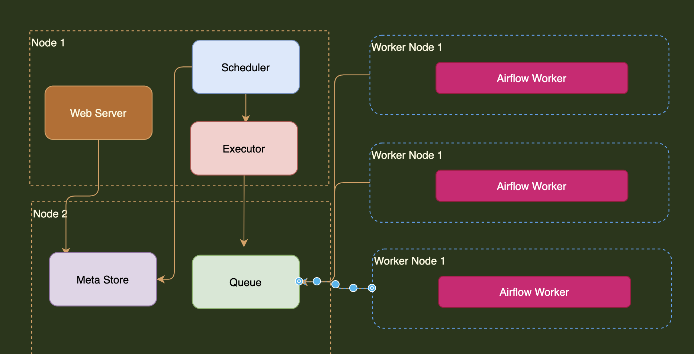
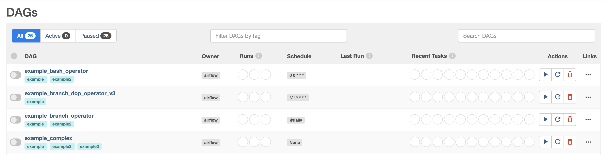
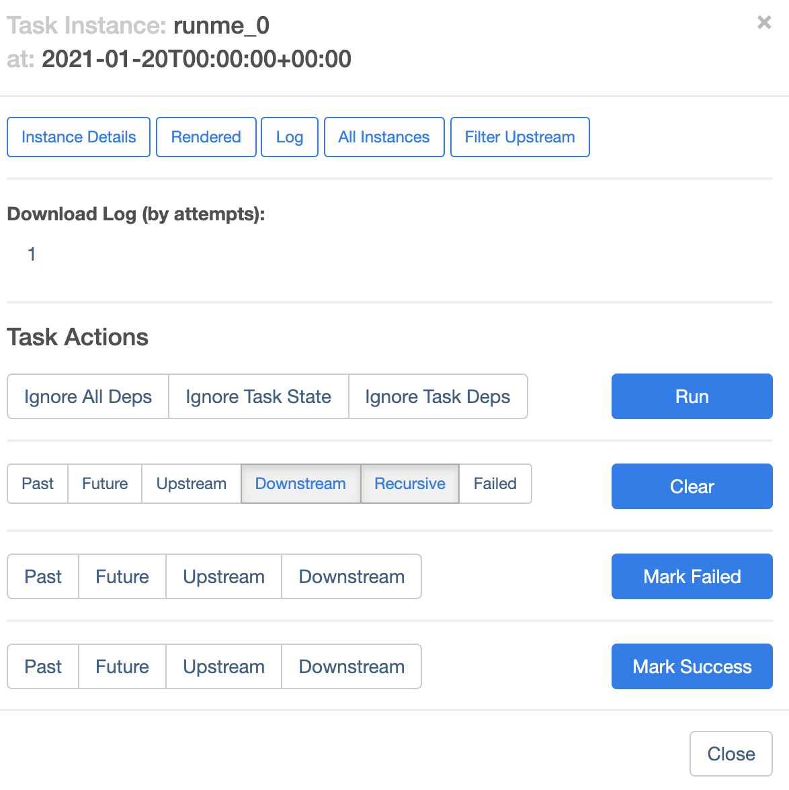
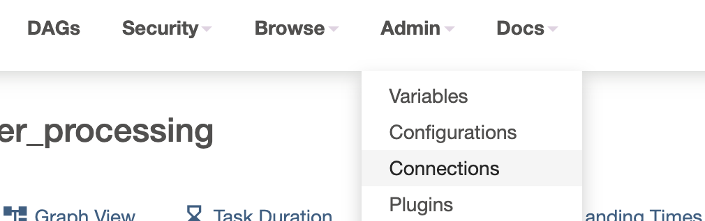
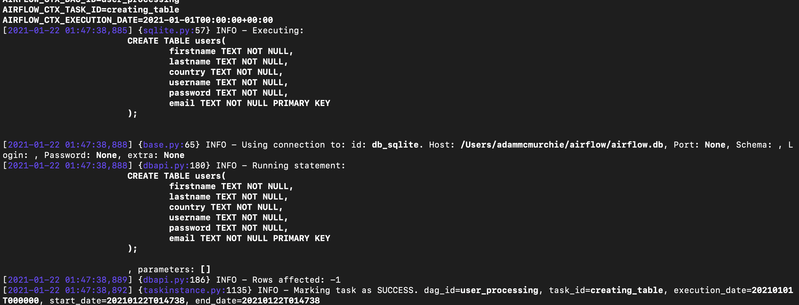

## Airflow  
     
[home](../../README.md).  
  


  

## Navigation
    

- [Intro](#Intro) 
- [Setup](#Setup) 
	- [Installing a provider/plugin](#Installing-a-provider)
- [Useful Commands](#Useful-Commands)
- [Architecture](#Architecture)
- [UI](#UI). 
- [Data Pipeline Example](#Data-Pipeline-Example)  


## Intro
   
[Navigation](#Navigation) 
  
  
### Quick Tips. 
  
- Always test every task after you make it.  
	- `airflow tasks test dagname taskid pastexecutiondate`   
  

### UseCases 

Used for `orchastrating datajobs` including the logic flow, to manage failures, notifications, extract, transform, load.  
  
Airflow also critically manages `mutliple pipelines` in parallel.  
    
- Extensible (build your own plugins)
- Dashboards 
- Uses python
- Scalable.   
  

To `author`, `schedule` and `monitor` data workflows.   
It allows you to orchastrate tasks in the right way, in the right order.  
  
    
### Core Components 
  

**Web server** Flask server with Gunicorn serving the UI  
**Scheduler** Daemon in charge of managing workflows. 
**metastore**  Database where metadata is stored  
  
**executor** class defining **how** your tasks will executor 
**worker** the process executing the task.  
  

## DAG  
  
DAG (Directed Acyclic Graph) is essentially a pipeline.  
  

  
  
**operator** is a task container, run by the worker.  
- Action Operator
- Transfer Operator
- Sensor Operator   
  
  
**ONLY RUN ONE OPERATOR FOR ONE TASK!!**. 
  

**Task** is the job ru .   
**task instance** is the specific runtime for a given task.  
	
## DAGS ARE NOT...  
  
- For streaming data
- For processing data (use a `spark submit` operator instead to prevent memory overflow). 
  
## Architecture
  
  

[Navigation](#Navigation)   

 
  

**Celery** architecture is:  
  
- Scalable 
- An executor on each node 
- Celery manages nodes and needs reddis/rabbitmq to manage queues.  
- Executor pushes tasks to the queue 
- Airflow workers fetch tasks and execute them on their own machine  

  
How it works:  
  
1. Data pipelines are added to `folder Dags`. 
2. Web server and executor parses `folder dags`. 
3. `DagRun` object is created in Metastore with status `running`. 
4. A `task instance` object is created and sent to executor 
5. Eexecutor updates `task instance` object in meta store, 
6. Once complete, `task instance` object updated again, and scheduler checks it is done.  
  
  

## Setup
  
[Navigation](#Navigation)   
  


Can create a VM and connect to it using ssh connection on visual studios. 
  
Or. 

1. Using `conda create --name airflowEnv python=3` to create env
2. Using `conda activate airflow` to manage dependencies.    
3. Use `conda env remove --name airflow` to delete once finished.  
4. Run `airflow db init` to start first time.  
5. Modify port on `airflow.cfg`  accordingly.  

  
But should specify the constraints file:  

```
pip install apache-airflow==2.0.0 --constraint https://gist.githubusercontent.com/marclamberti/742efaef5b2d94f44666b0aec020be7c/raw/5da51f9fe99266562723fdfb3e11d3b6ac727711/constraint.txt
```	  
  
Run to start: 
  
```sh
airflow db init 
```
  
Run to get dir path: 
  
```
airflow info
```   
  
### Installing a provider
  
Providers are just plugins, most of them may not need an install with the new version.  

Go to airflow docs
Pick the provider
Run pip install and the provider name 

i.e. `apache-airflow-providers-sqlite` 
  
  


#### Airflow Dir. 
  

```
airflow.cfg		airflow.db		logs			unittests.cfg		webserver_config.py
```

- config file `airflow.cfg` 
- Database `airflow.db`. 
- Unitests `unittests.cfg` to test configuration   
- webserver settings `webserver_config.py`. 
    


# Useful Commands
  
[Navigation](#Navigation) 
  
## CheatSheet 
   

```sh
airflow cheatsheet
```
  
#### Create Users 

```sh
airflow users create -u admin -p admin -f adam -l mcmurchie -r Admin -e admin@airflow.com

```

#### Start Scheduler

```sh
airflow scheduler -D
```
    
- This has to run in addition to webserver so use `-D` flag.  	 

#### List DAGS

```sh
airflow dags list
```
  
#### Lists Tasks for given DAG

```sh
airflow tasks list dag_name 
  
airflow tasks list example_python_operator
```
  
#### Trigger DAG datapipeline

```sh
airflow dags trigger -e 2021-01-01 dag_name
```
  
####

```sh

```

   


#### Help Flag 

```sh
airflow users create -h
```

#### Start Webserver  
   

```sh
airflow webserver
```


#### Init DB  
   
   
```sh
airflow db init
```
    
#### Reset DB 

```sh
airflow db reset

```
 
  
  
# UI
  

[Navigation](#Navigation) 
  


  
 
  
- Toggle the job on/off 
- `tags` help you group pipelines. 
- Owner could be airflow, team names i.e. marketing. 
- Runs is for status. 
- Schedule   
- Recent tasks (status). 
- Actions: trigger manually, refresh, delete (doesn't delete file, just metadata) 
- links gives you access to code, view, details etc.    
  
## Tree View 

  
 

    
- Useful for history of DAG runs 
- Each verticle slice is a run 
- Square is a task 
  
## Graph View 
    
. 
  
- Outline color represents the `status`
- Internal color represents the `operator` 
  
## Gantt View  
  

  
- Great for spotting bottlenecks
- helps to see how long each task is taking.  
- Allows for planning of parallel jobs.  
- Great for production.  
  

## Instance view 

. 
  

- Most important is the logs 
- `clear` task if you want to re-run 
- `mark fail / success`    
  
  
## Data Pipeline Example

[Navigation](#Navigation)   
  

FLOW:  
  

1. Create table `sql lite`
2. is-api available `http sensor `
3. fetch user `http operator` 
4. process user `python operator` 
5. store user `bash operator`   
  
    
```
/Users/adammcmurchie/2021/spark_RBS_prep/content/airflow
```

Create a Dag folder at:  
```sh
/Users/adammcmurchie/airflow/
```

Create a pipeline called `user_processing.py` in dag folder.  
  
```python
from airflow.models import DAG

# python deps
from datetime import datetime
  

# Applied to all operators. 
default_args = {
	'start_date':datetime(2021, 1,22)
}
  
  
## ID MUST BE UNIQUE
with DAG('user_processing', schedule_interval='@daily', 
	default_args=default_args, 
	catchup=False) as dag:
	# define task/operator

```

- `with DAG()` id must be unique. 
  
## Creating DB table  
  
 Add DB code, the stuff not commented are the changes  

```python
#from airflow.models import DAG
from airflow.providers.sqlite.operators.sqlite import SqliteOperator
 
"""
# python deps
from datetime import datetime
  

# Applied to all operators. 
default_args = {
	'start_date':datetime(2021, 1,22)
}
  

## ID MUST BE UNIQUE
with DAG('user_processing', schedule_interval='@daily', 
	default_args=default_args, 
	catchup=False) as dag:
	# define task/operator

"""

	# Unique id for each task required 
	creating_table = SqliteOperator(
		task_id = 'creating_table',
		sqlite_conn_id='db_sqlite',
		sql='''
			CREATE TABLE users(
				firstname TEXT NOT NULL,
				lastname TEXT NOT NULL,
				country TEXT NOT NULL,
				username TEXT NOT NULL,
				password TEXT NOT NULL,
				email TEXT NOT NULL PRIMARY KEY
			);

			'''

		)
```

- Now start webserver and scheduler using airflow command. 
- Check graph view to verify our DAG has one job 


Set up connection:  
- admin
- connections. 
<br/>
<br/>
<br/>
  



<br/>
<br/>
<br/>
<br/>
Add New connection:

- conn id = db_sqlite
- conn type = sqlite
- Description = sqlite conn to db
- host = /Users/adammcmurchie/airflow/airflow.db
	need to specify where the file corresponding to airflow.db is 


**Always test** every task after you make it.  
	- `airflow tasks test user_processing creating_table 2021-01-01`   

  
  
Verify in terminal: 

```sh
sqlite3 airflow.db

.tables 

SELECT * FROM users;
``` 
  

## Check API is Available

- We use the `http sensor` for this.  
  
```python

from airflow.providers.http.sensors.http import HttpSensor 

# python deps
from datetime import datetime


	is_api_available = HttpSensor(
		task_id = 'is_api_available',
		http_conn_id = 'user_api',
		endpoint = 'api/'
		)


```
- Above is the extra added to codebase.  
- `http_conn_id` is the api connection url to check.  
  
Now create a new connection, same way again admin --> connections.  
  
- `Conn id`   = user_api
- `Conn type` = Http
- `description` = API for getting users 
- `host`      = https://randomuser.me/
note it will check that host + `api/`
  
Save it and verify its setup.  
   
### Install the provider   
 
If not installed. 

`pip install 'apache-airflow-providers-http' `
    
Now run the test.  
  
`airflow tasks test user_processing is_api_available 2021-01-01`. 


  
## Backfill and Catchup 

Consider you run pipelines daily for a given DAG:  
  
- DAGRUN 1 01/01
- DAGRUN 2 02/01
- DAGRUN 3 03/01
   
DAG PUT ON HOLD  
 
- DAGRUN 4 04/01 **NOT EXECUTED** 
- DAGRUN 5 05/01 **NOT EXECUTED**   

If you start up again on the 06/01 for DAGRUN6, it will try to run DAGRUN 4 and 5 to **catchup** first.   
  
**BY DEFAULT AIRFLOW WILL RUN ALL PREVIOUS DAGRUNS UP TO PRESENT**   
   
- Starting from latest execution date
- It only backfills to earlier date if its the first run.  
	-  you can do this by going to `DAGRUNS` delete records.  

	  
We can turn this off by disabling catchup: 
  
```
catchup = False
``` 
    
Incode examples:  
  
```python
## ID MUST BE UNIQUE
with DAG('user_processing', schedule_interval='@daily', 
	default_args=default_args, 
	catchup=False) as dag:
	# define task/operator

```
  


# Notes.  
  
Training materials from marclaberti `https://github.com/marclamberti/training_materials` 

