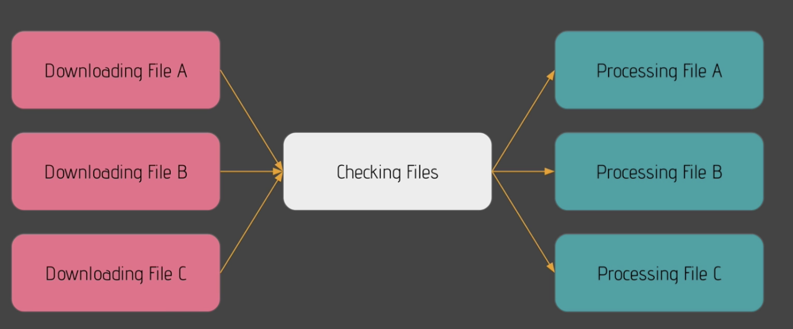
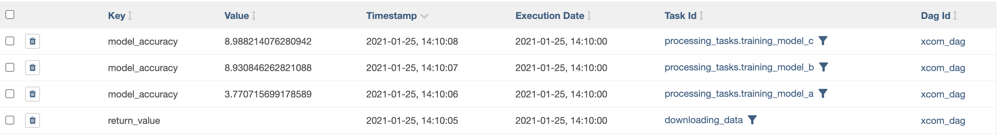

## Airflow  
     
[home](../../README.md).  
  


  

## Navigation
    

- [Intro](#Intro) 
- [Setup](#Setup) 
	- [Installing a provider/plugin](#Installing-a-provider)
- [Useful Commands](#Useful-Commands)
- [Architecture](#Architecture)
- [UI](#UI). 
- [Data Pipeline Example](#Data-Pipeline-Example)  
- [Backfill and Catchup](#Backfill-and-Catchup)
- [Parameters](#Parameters)
- [Subdags](#Subdags)
- [Task Groups](#Task-Groups)
- [Sharing Data between XCOMS](#Sharing-Data-between-XCOMS) 
- [Conditional Control](#Condition-Control)
- [plugins with elastic](#plugins)

## Intro
   
[Navigation](#Navigation) 
  
  
### Quick Tips
  
  
- For tasks, make the `python_callable=` a function to simplify flow and allow multiple tasks to do the same thing. 
- Make sure DAG name matches name of file or it wont load
- Plugins, need to create a plugin folder
- Always test every task after you make it.  
	- `airflow tasks test dagname taskid pastexecutiondate`   
- Scheduling times can be tricky.
- May need to remove XCOMs to free up memory `admin -> xcoms -> search/delete`  

**SQLITE DOES NOT ALLOW MULTIPLE WRITES AT THE SAME TIME** 
    

**USING AIFLOW**  
  
```sh

conda activate airflowEnv

af # alias to jump to dir 

airflow scheduler -D 
airflow webserver 
```


  
### UseCases 

Used for `orchastrating datajobs` including the logic flow, to manage failures, notifications, extract, transform, load.  
  
Airflow also critically manages `mutliple pipelines` in parallel.  
    
- Extensible (build your own plugins)
- Dashboards 
- Uses python
- Scalable.   
  

To `author`, `schedule` and `monitor` data workflows.   
It allows you to orchastrate tasks in the right way, in the right order.  
  
    
### Core Components 
  

**Web server** Flask server with Gunicorn serving the UI  
**Scheduler** Daemon in charge of managing workflows. 
**metastore**  Database where metadata is stored  
  
**executor** class defining **how** your tasks will executor 
**worker** the process executing the task.  
  

## DAG  
  
DAG (Directed Acyclic Graph) is essentially a pipeline.  
  

  
  
**operator** is a task container, run by the worker.  
- Action Operator
- Transfer Operator
- Sensor Operator   
  
  
**ONLY RUN ONE OPERATOR FOR ONE TASK!!**. 
  

**Task** is the job ru .   
**task instance** is the specific runtime for a given task.  
	
## DAGS ARE NOT...  
  
- For streaming data
- For processing data (use a `spark submit` operator instead to prevent memory overflow). 
  
## Architecture
  
  

[Navigation](#Navigation)   

 
  

**Celery** architecture is:  
  
- Scalable 
- An executor on each node 
- Celery manages nodes and needs reddis/rabbitmq to manage queues.  
- Executor pushes tasks to the queue 
- Airflow workers fetch tasks and execute them on their own machine  

  
How it works:  
  
1. Data pipelines are added to `folder Dags`. 
2. Web server and executor parses `folder dags`. 
3. `DagRun` object is created in Metastore with status `running`. 
4. A `task instance` object is created and sent to executor 
5. Eexecutor updates `task instance` object in meta store, 
6. Once complete, `task instance` object updated again, and scheduler checks it is done.  
  
  

## Setup
  
[Navigation](#Navigation)   
  


Can create a VM and connect to it using ssh connection on visual studios. 
  
Or. 

1. Using `conda create --name airflowEnv python=3` to create env
2. Using `conda activate airflow` to manage dependencies.    
3. Use `conda env remove --name airflow` to delete once finished.  
4. Run `airflow db init` to start first time.  
5. Modify port on `airflow.cfg`  accordingly.  

  
But should specify the constraints file:  

```
pip install apache-airflow==2.0.0 --constraint https://gist.githubusercontent.com/marclamberti/742efaef5b2d94f44666b0aec020be7c/raw/5da51f9fe99266562723fdfb3e11d3b6ac727711/constraint.txt
```	  
  
Run to start: 
  
```sh
airflow db init 
```
  
Run to get dir path: 
  
```
airflow info
```   
  
### Installing a provider
  
Providers are just plugins, most of them may not need an install with the new version.  

Go to airflow docs
Pick the provider
Run pip install and the provider name 

i.e. `apache-airflow-providers-sqlite` 
  
  


#### Airflow Dir. 
  

```
airflow.cfg		airflow.db		logs			unittests.cfg		webserver_config.py
```

- config file `airflow.cfg` 
- Database `airflow.db`. 
- Unitests `unittests.cfg` to test configuration   
- webserver settings `webserver_config.py`. 
    


# Useful Commands
  
[Navigation](#Navigation) 
  
## CheatSheet 
   

```sh
airflow cheatsheet
``` 
### Kill Airflow Scheduler 

- Run at base airflow dir 
  
```sh
cat airflow-scheduler.pid | xargs kill
```
    
#### Create Users 

```sh
airflow users create -u admin -p admin -f adam -l mcmurchie -r Admin -e admin@airflow.com

```

#### Start Scheduler

```sh
airflow scheduler -D
```
    
- This has to run in addition to webserver so use `-D` flag.  	 

#### List DAGS

```sh
airflow dags list
```
  
#### Lists Tasks for given DAG

```sh
airflow tasks list dag_name 
  
airflow tasks list example_python_operator
```
  
#### Trigger DAG datapipeline

```sh
airflow dags trigger -e 2021-01-01 dag_name
```
  
####

```sh

```

   


#### Help Flag 

```sh
airflow users create -h
```

#### Start Webserver  
   

```sh
airflow webserver
```


#### Init DB  
   
   
```sh
airflow db init
```
    
#### Reset DB 

```sh
airflow db reset

```
 
  
  
# UI
  

[Navigation](#Navigation) 
  


  
 
  
- Toggle the job on/off 
- `tags` help you group pipelines. 
- Owner could be airflow, team names i.e. marketing. 
- Runs is for status. 
- Schedule   
- Recent tasks (status). 
- Actions: trigger manually, refresh, delete (doesn't delete file, just metadata) 
- links gives you access to code, view, details etc.    
  
## Tree View 

  
 

    
- Useful for history of DAG runs 
- Each verticle slice is a run 
- Square is a task 
  
## Graph View 
    
. 
  
- Outline color represents the `status`
- Internal color represents the `operator` 
  
## Gantt View  
  

  
- Great for spotting bottlenecks
- helps to see how long each task is taking.  
- Allows for planning of parallel jobs.  
- Great for production.  
  

## Instance view 

. 
  

- Most important is the logs 
- `clear` task if you want to re-run 
- `mark fail / success`    
  
    
<br/>
<br/>
<br/>
<br/>
<br/>
<br/>
<br/>
<br/>
<br/>
<br/>
<br/>
<br/>

# Data Pipeline Example

[Navigation](#Navigation)   
  
This DAG sample, shows us how to first:   
Create a skeleton DAG.    
Then add a table to our database using sqlite, set up the connection and validate with a test.  
Next we check an external API for user extraction is available using `http sensor` and setting up another connection for this.  
We then download/extract the user with a get call using Using `simpleHttpOperator` and verifying with a test.  
Next we parse the ouput of that task (xcom_pull) to process the data into json using pandas json_normalize and save to csv. 
Finally we add the data to our database using `bash operator`.  

## FLOW  
  
0. [Create Skeleton DAG](#Create-Skeleton-DAG)
1. [Creating DB table](#Creating-DB-table) `sql lite`
2. [Check API is Available](#Check-API-is-Available) `http sensor `
3. [Fetch User](#Fetch-User) `http operator` 
4. [Process User](#Process-User) `python operator` 
5. [Storing Users to Database](#Storing-Users-to-Database) `bash operator`  
6. [Specifying DAG Order](#Specifying-DAG-Order) 
  

### Create Skeleton DAG
```
/Users/adammcmurchie/2021/spark_RBS_prep/content/airflow
```

Create a Dag folder at:  
```sh
/Users/adammcmurchie/airflow/
```

Create a pipeline called `user_processing.py` in dag folder.  
  
```python
from airflow.models import DAG

# python deps
from datetime import datetime
  

# Applied to all operators. 
default_args = {
	'start_date':datetime(2021, 1,22)
}
  
  
## ID MUST BE UNIQUE
with DAG('user_processing', schedule_interval='@daily', 
	default_args=default_args, 
	catchup=False) as dag:
	# define task/operator

```

- `with DAG()` id must be unique. 
  
## Creating DB table  
  
 Add DB code, the stuff not commented are the changes  

```python
from airflow.providers.sqlite.operators.sqlite import SqliteOperator
 
	...


	# Unique id for each task required 
	creating_table = SqliteOperator(
		task_id = 'creating_table',
		sqlite_conn_id='db_sqlite',
		sql='''
			CREATE TABLE users(
				firstname TEXT NOT NULL,
				lastname TEXT NOT NULL,
				country TEXT NOT NULL,
				username TEXT NOT NULL,
				password TEXT NOT NULL,
				email TEXT NOT NULL PRIMARY KEY
			);

			'''

		)
```

- Now start webserver and scheduler using airflow command. 
- Check graph view to verify our DAG has one job 


Set up connection:  
- admin
- connections. 
<br/>
<br/>
<br/>
  

FROM UI SELECT `Admin -> Connections` 

<br/>
<br/>
<br/>
<br/>
Add New connection:

- conn id = db_sqlite
- conn type = sqlite
- Description = sqlite conn to db
- host = /Users/adammcmurchie/airflow/airflow.db
	need to specify where the file corresponding to airflow.db is 


**Always test** every task after you make it.  

```
airflow tasks test user_processing creating_table 2021-01-01
```   
  
  
  
Verify in terminal: 

```sh
sqlite3 airflow.db

.tables 

SELECT * FROM users;
``` 
  

## Check API is Available

- We use the `http sensor` for this.  
  
```python

from airflow.providers.http.sensors.http import HttpSensor 

# python deps
from datetime import datetime

	...


	is_api_available = HttpSensor(
		task_id = 'is_api_available',
		http_conn_id = 'user_api',
		endpoint = 'api/'
		)


```
- Above is the extra added to codebase.  
- `http_conn_id` is the api connection url to check.  
  
Now create a new connection, same way again admin --> connections.  
  
- `Conn id`   = user_api
- `Conn type` = Http
- `description` = API for getting users 
- `host`      = https://randomuser.me/
note it will check that host + `api/`
  
Save it and verify its setup.  
   
### Install the provider   
 
If not installed. 

`pip install 'apache-airflow-providers-http' `
    
Now run the test.  
  
```
airflow tasks test user_processing is_api_available 2021-01-01
```

  
 
## Fetch User

Fetch User from API (external website) - fetch result from randomuser url.  
 
Using `simpleHttpOperator`
  
##### Added Code  

```python
from airflow.providers.http.operators.http import SimpleHttpOperator 
import json 


	...


	extracting_user = SimpleHttpOperator(
		task_id = 'extracting_user',
		http_conn_id = 'user_api',
		endpoint = 'api/',
		method = 'GET',
		response_filter = lambda response: json.loads(response.text),
		log_response = True

		)


```
  
Test this task again using:  
  
`airflow tasks test user_processing extracting_user 2021-01-01`. 
  


## Process User

We are going to use the most popular operator `python operator` to process the returned data from previous task using `xcom_pull` operation.  
  
- create a task to process user
- We create a `python function` that it uses
- This function has the `task instance` ti passed in.
- So it can group the output of previous task, parse the data and save to json format
- This is done using `pandas json_normalize` 
  
- `xcom` is a key in the airflowdb, it's value is the output of that tasks. 

  
#### Added Code  

```python
from airflow.operators.python import PythonOperator

from pandas import json_normalize

def _processing_user(ti):
	users = ti.xcom_pull(task_ids=['extracting_user'])


	# if ouput empty, or not the expected value
	if not len(users) or 'results' not in users[0]:
		raise ValueError('User is empty')

	user = users[0]['results'][0]

	## This becomes pandas dataframe
	processed_user = json_normalize({
		'firstname': user['name']['first'] ,
		'lastname' : user['name']['last'],
		'country' : user['location']['country'],
		'username' : user['login']['username'],
		'password' : user['login']['password'],
		'email': user['email']
	})

	# header false means it doesn't save first row
	processed_user.to_csv('/tmp/processed_user.csv', index=None, header=False)


	...


	processing_user = PythonOperator(
		task_id = 'processing_user',
		python_callable = _processing_user

		)


```

 
  
Validate task works properly:  
  
```
airflow tasks test user_processing processing_user 2021-01-01
``` 
  

Check the file is created in tmp folder

```sh
cat /tmp/processed_user.csv 
```
Output:  
  
```
Kristin,Grube,Germany,silverfish154,celebrity,kristin.grube@example.com
```
  
## Storing Users to Database

- use bash operator

 
```python
from airflow.operators.bash import BashOperator
	...

	storing_user = BashOperator(
		task_id = 'storing_user',
		bash_command='echo -e ".separator ","\n.import /tmp/processed_user.csv users" | sqlite3 /Users/adammcmurchie/airflow/airflow.db'
		)
```

It's **REALLY IMPORTANT** to follow exact syntax, can not have spaces like `bash_command = 'echo ...etc` 
  
The command does the following:

- `echo -e` means enable backslahs interpretation
- import the csv inside the table users
- these two commands are executed inside the command 
 - `sqlite3 /Users/adammcmurchie/airflow/airflow.db`. 

so essentially echo the first bit into the pipped second bit. 
  
Test it first to execute:  

```
airflow tasks test user_processing storing_user 2021-01-01
```


  
<br/> 
<br/>
<br/>
<br/>
<br/>


  


## Specifying DAG Order


  
Note DAG, if run, any could start first, no dependency is set. 


We define order using `dependencies` defined in the DAG by bitshift operators `<< >>` operators and `set_upstream` , `set_downstream` functions.   
    

```python
creating_table >> is_api_available >> extracting_user >> processing_user >> storing_user
```
  


Now notice the updated graph:  


Now kick off the dag from the UI: 

Simply turn on the trigger: 

Note the table already exists after we tested it early.  So update previous SQL statement to 

```SQL
CREATE TABLE IF NOT EXISTS users...
```
  
You may need to refresh and clear tasks history to start again.  
    
## Stretch Goal  
 
- Manage exceptions such as if API check/get fails. 


# Theory 
  
  

## Dag Scheduling
    
Need to validate start dates, as it may be startdate + frequency.  
  
`schedule_interval`  : Defines how often a DAG should run from **start_date** + **schedule_time**. 


Question: Let's assume your dag has a start_date with October,22,2018 10:00:00 PM UTC and you have started the DAG at 10:30:00 PM UTC with the schedule_interval of `*/10 * * * *` (After every 10 minutes). How many DagRuns are going to be executed?. 

Anser: 3: The first one is executed at 10:00, then 10:10 and 10:20. 10:30 is not yet executed since the DAG runs once the `schedule_interval` (10 minutes here) is passed.  
  


## Productionising & Scaling

  
how to configure Airflow to execute multiple tasks? 

What are the important parameters to know in order to tune?    
  
What are the different executors for scaling Airflow?  
  


### Configuration 

- we need to change if we want to change how many tasks we execute at same time.  
- Default, executes `sequentually` even if tasks are at same level in parallel.  


Check parameters by running:  
  
```
airflow config get-value core sql_alchemy_conn
```
  

Two parameters are used: 


`sql_alchemy_conn`   `executor` 
    
    

Running : 

```
airflow config get-value core executor
```
gives us : `SequentialExecutor` 
  


  
	


  
## Backfill and Catchup

Consider you run pipelines daily for a given DAG:  
  
- DAGRUN 1 01/01
- DAGRUN 2 02/01
- DAGRUN 3 03/01
   
DAG PUT ON HOLD  
 
- DAGRUN 4 04/01 **NOT EXECUTED** 
- DAGRUN 5 05/01 **NOT EXECUTED**   

If you start up again on the 06/01 for DAGRUN6, it will try to run DAGRUN 4 and 5 to **catchup** first.   
  
**BY DEFAULT AIRFLOW WILL RUN ALL PREVIOUS DAGRUNS UP TO PRESENT**   
   
- Starting from latest execution date
- It only backfills to earlier date if its the first run.  
	-  you can do this by going to `DAGRUNS` delete records.  


We can turn this off by disabling catchup: 
  
```
catchup = False
``` 
    
Incode examples:  
  
```python
## ID MUST BE UNIQUE
with DAG('user_processing', schedule_interval='@daily', 
	default_args=default_args, 
	catchup=False) as dag:
	# define task/operator

```

## Parameters
  
In config file.  
  
 - `parallelism` is how many jobs max, **this can be set in one dag only rather than the whole airflow**  
 - `dag_concurrency` The number of concurrent tasks max  
 - `max_active_runs_per_dag`  
 - `load_examples` to toggle on/off

## Subdags  
  
**NOT RECOMMENDED**  
  
1. You could end up with deadlocks (not being able to execute any more tasks)  
2. subdags are quite complex.  
3. Have their own executor.  
  
but if we want to do them:  
    
Group a bunch of similar tasks into a subdag, to simplify the flow.  
  
from this:  

  
    
to this:  
  

  
  
  
Import subdag operator:  
  
```python
from airflow.operators.subdag import SubDagOperator
```

- Create subdag folder  
- Add a `subDagOperator` task
- Create a function for the subdag


Instead of say task one and two like below in a dag:  


`parallel_dag.py`  

```python 

with DAG('parallel_dag', schedule_interval='@daily', 
	default_args=default_args, 
	catchup=False) as dag:


	task_1 = BashOperator(
	task_id = 'task_1',
	bash_command = 'sleep 3'
	)
	task_2 = BashOperator(
	task_id = 'task_2',
	bash_command = 'sleep 3'
	)

...
```     

we add these to a subdag file: 
`subdag_parallel_dag.py`   
  

```python
def subdag_parallel_dag(parent_dag_id, child_dag_id, default_args):
	with DAG(dag_id=f'{parent_dag_id}.{child_dag_id}' , default_args = default_args) as dag:
		task_1 = BashOperator(
		task_id = 'task_1',
		bash_command = 'sleep 3'
		)
		task_2 = BashOperator(
		task_id = 'task_2',
		bash_command = 'sleep 3'
		)

		return dag
```


  

Then we modify dag folder to add the following:   
  
`parallel_dag.py`    

```python

from airflow.operators.subdag import SubDagOperator

## Import the actual subdag module we made
from subdags.subdag_parallel_dag  import subdag_parallel_dag

processing = SubDagOperator(
	task_id = 'processing_tasks',
	subdag = subdag_parallel_dag('parallel_dag' , 'processing_tasks', default_args)
	)  
  
task_1 >> [task_2,task_3] >> task_4
```  

- import subdag operator 
- import our subdag module 
- add SubDagOperator tasks, subdag has to be subdag method name with parent DAG name passed in and child dag id
- Delete the two tasks we are subdagging 
- update dependencies 
  

When viewing these, we just zoom into it in the UI.  
  
  


## Task Groups

  
Instead of all the steps above, we can just run the following:  
  
```python

from airflow.utils.task_group import TaskGroup 
  
... task1


with TaskGroup('processing_tasks') as processing_tasks:
	task_2 = BashOperator(
		task_id = 'task_2',
		bash_command = 'sleep 3'
		)
	task_3 = BashOperator(
		task_id = 'task_3',
		bash_command = 'sleep 3'
		)	


... task4


task_1 >> processing_tasks >> task_4
```
  


We can actually  **NEST TASK GROUPS** to get a task run specific group but need to read up more on this.  
  
```python

from airflow.utils.task_group import TaskGroup 
  

with TaskGroup('processing_tasks') as processing_tasks:

... task1


	task_2 = BashOperator(
		task_id = 'task_2',
		bash_command = 'sleep 3'
		)

	with TaskGroup('spark_tasks') as spark_task:
		task_3 = BashOperator(
			task_id = 'task_3',
			bash_command = 'sleep 3'
			)	
	with TaskGroup('flink_tasks') as flink_tasks:
		task_3 = BashOperator(
			task_id = 'task_3',
			bash_command = 'sleep 3'
			)	


... task4 

task_1 >> processing_tasks >> task_4
```
      

<br/>
<br/>  


# Sharing Data between XCOMS
    
### XCOM (Cross Communications)      
  
  
### In a Nutshell.  

```python
# PUSH XCOM  
# The push could be in a method used by tasks  
python_callable = ti.xcom_push(key='model_accuracy', value=accuracy)

## PULL XCOM  
# it pulls from any task id defined (full path)
accuracies = ti.xcom_pull(key='model_accuracy', 
	task_ids=['processing_tasks.training_model_a'])

```

### Notes  

- Used for exchanging messages between tasks
- A little objects, with a `key` used as an `identifier`in order to pull data from task.  
- Be carful, as they are limited in size.  
	- This data is stored in metadatabase (64kb for sqlite)  
- Note xcoms will be overwritten if same task/key
- Operators push XCOMS to disable add `do_xcom_push = False` in operator instantiation.  


Take this use case:   
  
```sh
TASK: ListingFileNames   >>   TASK: DownloadingFiles
```
  
- We could get the names list by using external mem (db, storage etc) via push/pull.  
	- this adds complexity.  

### EXAMPLE XCOMS PROGRAM  
    
<br/>
<br/>  

  
  

```python
from airflow import DAG
from airflow.operators.bash import BashOperator
from airflow.operators.python import PythonOperator
from airflow.operators.subdag import SubDagOperator
from airflow.utils.task_group import TaskGroup

from random import uniform
from datetime import datetime

default_args = {
    'start_date': datetime(2020, 1, 1)
}

def _training_model():
    accuracy = uniform(0.1, 10.0)
    print(f'model\'s accuracy: {accuracy}')

def _choose_best_model():
    print('choose best model')

with DAG('xcom_dag', schedule_interval='@daily', default_args=default_args, catchup=False) as dag:

    downloading_data = BashOperator(
        task_id='downloading_data',
        bash_command='sleep 3'
    )

    with TaskGroup('processing_tasks') as processing_tasks:
        training_model_a = PythonOperator(
            task_id='training_model_a',
            python_callable=_training_model
        )

        training_model_b = PythonOperator(
            task_id='training_model_b',
            python_callable=_training_model
        )

        training_model_c = PythonOperator(
            task_id='training_model_c',
            python_callable=_training_model
        )

    choose_model = PythonOperator(
        task_id='task_4',
        python_callable=_choose_best_model
    )

    downloading_data >> processing_tasks >> choose_model
``` 
  
  
- Each subtaks just calls a function which gens a random number
- the final tasks just prints `chose best model`  
  
First let's **push XCOM** value, so the training method passes its random number on.    
    

1. Simply add a reurn statement in the function (it gets passed to `python_callable`)  
  
  
```python
#def _training_model():
#    accuracy = uniform(0.1, 10.0)
#    print(f'model\'s accuracy: {accuracy}')
    return(accuracy)
```  
  
2. Run the job and look at the xcoms output from admin dropdown:  
    
  
  
`key` the identifier of xcom , so we can pull from database 
`value` the data we share between tasks (it needs to be serialisable in json/pickle)  
  
Note the task ID column:  
 
`processing_tasks.training_model_a`  
`processing_tasks.training_model_b`  
`processing_tasks.training_model_c`  
  

It says where it got **pushed from**.  
  
Now let's **PUSH XCOM WITH DEFINED VALUE**  
  
  
1. Simply specify `ti` in the method  
  
  
```python
def _training_model(ti):
    accuracy = uniform(0.1, 10.0)
    print(f'model\'s accuracy: {accuracy}')
    ti.xcom_push(key='model_accuracy', value=accuracy)
```  
2. Note the change in values returned.  
  


<br/>    
  
Let's **PULL XCOMS**  
    
1. For last task, simply use `ti.com_pull` with key, task_ids (using full path)  
2. 
```python

def _choose_best_model(ti):
    print('choose best model')
    print('Values are')
    accuracies = ti.xcom_pull(
    	key='model_accuracy', 
    	task_ids=['processing_tasks.training_model_a',
    	'processing_tasks.training_model_b',
    	'processing_tasks.training_model_c'])
    print(accuracies)

```
  
- We can validate this worked by viewing the logs on task four and looking at print statement.  
  
<br/>

## Condition Control   
    

We do this using the **branchPythonOperator**  
  

From the example above, where we have three subtasks returning random accuracy number.  
  
- `choose_model` task based on accuracy condition  
  
1. Import operator

```python
from airflow.operators.python import branchPythonOperator
```

2. In your tasks section, at the bottom add a branch operator for accuracy eval:  

```python

#    choose_model = PythonOperator(
#        task_id='task_4',
#        python_callable=_choose_best_model
#    )
	...

    is_accurate = BranchPythonOperator(
        task_id='is_accurate',
        python_callable=_is_accurate)
```
    
3. Then define the function:  
  
```python

def _is_accurate():
	return('accurate')
  
```

<br/>


# Plugins  
   
- have to create plugin folder
- airflow less than 2.0 u need to specify tons and plugin class, now you just create python modules. 
- plugins lazy loaded, you need to restart server
- after that can modify on the fly  

<br/>  
  

# Notes.  
  
Training materials from marclaberti `https://github.com/marclamberti/training_materials` 

