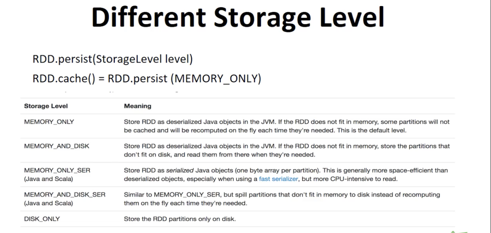
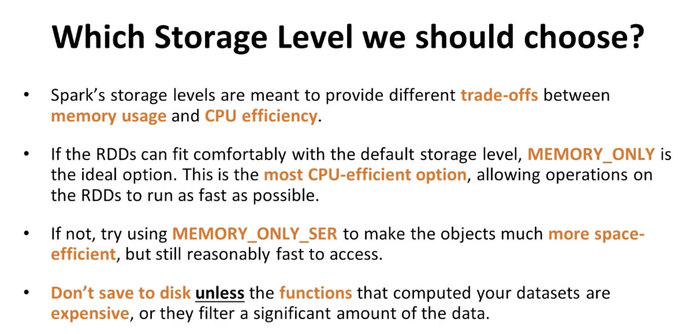

| Topics | Sub Topics |
|-------|-------------|
|[home](../..//README.md)    |  |
|     | [Pair RDDs](#Pair-RDDs) |
|     | [PairRDD Operations](#PairRDD-Operations) |
|     | [Actions and Transformations](#Actions-and-Transformations)| 
|     | [Examples](#Examples)
|     | [Advanced Topics](#Advanced-Topics)
|     | [Sample Problems](#Sample-Problems)
|     | [Persistence and Caching](#Persistence-and-Caching) |


# RDD
    
[Navigation](#Navigation)  
  

Resilient Distributed Dataset (RDD)    
  
**"RDD IS A CAPSULATION AROUND A LARGE DATASET"**  
    
- The most important concept
- RDD can contain **any type of object** including user defined classes.
- In Spark **all work** is 
	- Creating RDDs
	- Transforming RDDs
	- Applying operations to RDDs to compute results    

- Spark shards and distributes your data under the hood 
	- It parellelizes the operations you perform on them . 

- RDDs are distributed  
	- broken into multiple pieces called **partitions** 
	- These are divided accross  **clusters**  
	- 8 partitions could run on 8 nodes
	- Auto done on spark, and **immutable** don't change to keep them resilient.  
  
  
  
Spark only really starts computation (loading etc) once it sees an action and not a transformation.  
 
- Lazy eval to reduce operations.  
  
  
  
## General Spark Flow with RDDs  
  
1. Generate **initial RDDS** from external Data.  
2. Apply **transformations** 
3. Launch **actions**
  
  
    
## Creating RDDs  
  
Simplest method is : 
- Take existing collection 
- Pass into sparkContext's `parallelize` method  
    
**Parallelise operation**  

```python  
inputIntegers = list(range(1,6))
integerRdd   = sc.parallelize(inputIntegers)
```          

**SparkContext**   represents a connection to a computer cluster.  

    
- All elements will be copied into a **distributed dataset**    
- which can be operated on in parallel  
	- handy for small datasets 
- **not practical** for working on large datasets (because we will need to slice/dice em first)  
  

    
A better way is to read from **external storage**  
    
**Read from textfile**  

```python
sc = SparkContext("local", "textfile") 
lines = sc.textFile("in/uppercase.txt")
```
    
More realistic approach is using **HDFS** or db integration with **JDBC**, **CASSANDRA**, **ELASTISEARCH**  
  
  


  
## Pair RDDs
  

   
[Navigation](#Navigation)  
    
  


- key value pairs 
- each row is one key - multiple values    
  
A **pair RDD** is a particular RDD that stores key/value pairs, we can create them from normal RDDs .  

Methods:  
  
- return pair RDDs from **tuple**  
- convert RDD to pair RDD  using **parallelie** function.   
    
## creating a pair-rdd from tuple  

```python
conf = SparkConf().setAppName("create").setMaster("local")
sc = SparkContext(conf = conf)

tuples = [("Lily", 23), ("Jack", 29), ("Mary", 29), ("James", 8)]
pairRDD = sc.parallelize(tuples)

pairRDD.coalesce(1).saveAsTextFile("out/pair_rdd_from_tuple_list")

```
      
`coalesce` functiontion reduces number of partitions to what we pass in. 
This is good because it reduces to a single file (for our text file).  
  
**output**  
  
```
('lily',23)
('jack',32)
...
etc  
```  
  
  

## creating a pair-rdd from regular rdd  
  
```python 
conf = SparkConf().setAppName("create").setMaster("local")
sc = SparkContext(conf = conf)

inputStrings = ["Lily 23", "Jack 29", "Mary 29", "James 8"]
regularRDDs = sc.parallelize(inputStrings)

pairRDD = regularRDDs.map(lambda s: (s.split(" ")[0], s.split(" ")[1]))
pairRDD.coalesce(1).saveAsTextFile("out/pair_rdd_from_regular_rdd")

```
1. regular rdd from list of strings
2. parallelise to rdd 
2. we map the rdd and turn it into touple rdd/ pair rdd  
  

## PairRDD Operations  
  
   
[Navigation](#Navigation)  
    

- support same functions as regular rdds  
- but we need to pass functions that work on **tuples** only  
   
### filter  
    
- generate pair rdd
- remove all airports not in the USA  
- output to file  

```python
if __name__ == "__main__":

    conf = SparkConf().setAppName("airports").setMaster("local[*]")
    sc = SparkContext(conf = conf)

    airportsRDD = sc.textFile("in/airports.text") # load into string RDD

    # create touble/pair RDD
    airportPairRDD = airportsRDD.map(lambda line: \
        (Utils.COMMA_DELIMITER.split(line)[1],
         Utils.COMMA_DELIMITER.split(line)[3]))

    # filter value != usa
    airportsNotInUSA = airportPairRDD.filter(lambda keyValue: keyValue[1] != "\"United States\"")

    airportsNotInUSA.saveAsTextFile("out/airports_not_in_usa_pair_rdd.text")

```  
**out**  
```
"Putnam County Airport", "Greencastle"
"Dowagiac Municipal Airport", "Dowagiac"
"Cambridge Municipal Airport", "Cambridge"
"Door County Cherryland Airport", "Sturgeon Bay
```  
   
### Map values  
  
- keys stay the same  
    
Challenge:  
- convert countryname to upper case 
- output to file  
  

```python
if __name__ == "__main__":
    conf = SparkConf().setAppName("airports").setMaster("local[*]")
    sc = SparkContext(conf = conf)

    # conver to string rdd
    airportsRDD = sc.textFile("in/airports.text")

    # again creating touple rdd using index 
    airportPairRDD = airportsRDD.map(lambda line: \
        (Utils.COMMA_DELIMITER.split(line)[1], \
      Utils.COMMA_DELIMITER.split(line)[3]))
  
  	# map 
  	# argument is original val, return is upper case
    upperCase = airportPairRDD.mapValues(lambda countryName: countryName.upper())

    upperCase.saveAsTextFile("out/airports_uppercase.text")
```
OUT  
```
('"Namanga"', '"KENYA"')
('"Phu Quoc"', '"VIETNAM"')
```  
  
### Aggregation (reduceByKey)
  
- Most popular transformation types for pair rdd  
- sum/add/combine all values for a given key  
Known as **reduceByKey**
- Runs lots of **parallel reduce operations** for each key (and its values) 
- Returns an RDD, of key and aggregated values  
  
In wordcount example we used `countByValue` but this is an action in memory, so the **reduceByKey** is better as it creates an RDD.  
  
```python
if __name__ == "__main__":
    conf = SparkConf().setAppName("wordCounts").setMaster("local[3]")
    sc = SparkContext(conf = conf)

    lines = sc.textFile("in/word_count.text")
    wordRdd = lines.flatMap(lambda line: line.split(" "))  # still use flatmap 
    wordPairRdd = wordRdd.map(lambda word: (word, 1))      # each key will have word,1

    wordCounts = wordPairRdd.reduceByKey(lambda x, y: x + y) # sum together counts of each word using reducebyKey this will 
    for word, count in wordCounts.collect(): # collects them to driver program
        print("{} : {}".format(word, count))

```  
OUT:  
```
city : 2 
rail : 1
...
etc
```  
  
## bedroom problem 
- a big csv with lots of column s
- we want the average price for different bedroms 

like this:  

    
```
       (3, 325000)
       (1, 266356)
       (2, 325000)
```
  
  


```python
if __name__ == "__main__":
    conf = SparkConf().setAppName("avgHousePrice").setMaster("local[3]")
    sc = SparkContext(conf = conf)

    lines = sc.textFile("in/RealEstate.csv")
    cleanedLines = lines.filter(lambda line: "Bedrooms" not in line) ## keep bedroom lines

    # create bed/price tuple
    # avg count is an object/class
    # key = '1','2','3' beds value = average number i.e. 3500
    housePricePairRdd = cleanedLines.map(lambda line: \
        (line.split(",")[3], AvgCount(1, float(line.split(",")[2]))))

    # get totals so we can average totals at the end
    # use averagecount class (external file)
    housePriceTotal = housePricePairRdd \
        .reduceByKey(lambda x, y: AvgCount(x.count + y.count, x.total + y.total))

    # print intermediate pair rdd 
    print("housePriceTotal: ")
    for bedroom, avgCount in housePriceTotal.collect():
        print("{} : ({}, {})".format(bedroom, avgCount.count, avgCount.total))
    
    # aerage values 
    housePriceAvg = housePriceTotal.mapValues(lambda avgCount: avgCount.total / avgCount.count)
    print("\nhousePriceAvg: ")
    for bedroom, avg in housePriceAvg.collect():
        print("{} : {}".format(bedroom, avg))


```


## Group by Key  
  
- if we are happy with the RDD, this will group all values to one key
- key with iterable values  
  
Instead of a line for each, we want it like this:  

```
"Canada", ["Bagotville", "Montreal", "Coronation", ...]
```
**solution**  
  
```python

if __name__ == "__main__":

    conf = SparkConf().setAppName("airports").setMaster("local[*]")
    sc = SparkContext(conf = conf)

    lines = sc.textFile("in/airports.text")  # string rdd

    # map to pair RDD
    countryAndAirportNameAndPair = lines.map(lambda airport:\
         (Utils.COMMA_DELIMITER.split(airport)[3],
          Utils.COMMA_DELIMITER.split(airport)[1]))

    # apply group simply
    airportsByCountry = countryAndAirportNameAndPair.groupByKey()

    # print out
    for country, airportName in airportsByCountry.collectAsMap().items():
        print("{}: {}".format(country, list(airportName)))
```

**Learn more about collect**  
```
    for country, airportName in airportsByCountry.collectAsMap().items():
        print("{}: {}".format(country, list(airportName)))
```
  
## reduceByKey vs groupByKey  
  
```
groupByKey + [reduce,map,mapValues]
```  
Can be replaced by aggregation function such as `reduceByKey`  
  
```python
if __name__ == "__main__":
    conf = SparkConf().setAppName('GroupByKeyVsReduceByKey').setMaster("local[*]") 
    sc = SparkContext(conf = conf)

    # list of words to pairRDD
    words = ["one", "two", "two", "three", "three", "three"]
    wordsPairRdd = sc.parallelize(words).map(lambda word: (word, 1))

    # this aggregates number for each word 
    wordCountsWithReduceByKey = wordsPairRdd \
        .reduceByKey(lambda x, y: x + y) \
        .collect()
    print("wordCountsWithReduceByKey: {}".format(list(wordCountsWithReduceByKey)))

    ## another method group, then map and collect
    wordCountsWithGroupByKey = wordsPairRdd \
        .groupByKey() \
        .mapValues(len) \
        .collect()
    print("wordCountsWithGroupByKey: {}".format(list(wordCountsWithGroupByKey)))
``` 
  
  
- Groupbykey is slower because there is more shuffling around of keys into bins first
- reduce by just adds up each keys values   
  
## sortByKey  
  
- sort by key if there is defined order   
  
#### sortByKey in reverse order  
  
```python
def sortByKey(self, ascending=True, numPartitions=None, keyfunc=lambda x: x):
	housePriceAvg.sortByKey(ascending=False)
```  
  
**problem** - sort our average house price by bedrooms in order 

```python
if __name__ == "__main__":
    conf = SparkConf().setAppName("averageHousePriceSolution").setMaster("local[*]")
    sc = SparkContext(conf = conf)

    ## same as before, but use int for our key (so we can sort)
    lines = sc.textFile("in/RealEstate.csv")
    cleanedLines = lines.filter(lambda line: "Bedrooms" not in line)
    housePricePairRdd = cleanedLines.map(lambda line: \
    ((int(float(line.split(",")[3]))), AvgCount(1, float(line.split(",")[2]))))

    # same as before
    housePriceTotal = housePricePairRdd.reduceByKey(lambda x, y: \
        AvgCount(x.count + y.count, x.total + y.total))

    housePriceAvg = housePriceTotal.mapValues(lambda avgCount: avgCount.total / avgCount.count)

    # this is where we sort
    sortedHousePriceAvg = housePriceAvg.sortByKey()

    for bedrooms, avgPrice in sortedHousePriceAvg.collect():
        print("{} : {}".format(bedrooms, avgPrice))

```  
  
## sortBy transformation  
    
- this lets us sort PAIR RDD by value
- build in, we just use it   

```python
sortedWordCountPairs = wordToCountPairs.sortBy(lambda wordCount: wordCount[1], ascending=False)
```
  
FULL EXAMPLE WITH WORD SORT 
```python  
conf = SparkConf().setAppName("wordCounts").setMaster("local[*]")
sc = SparkContext(conf = conf)

lines = sc.textFile("in/word_count.text")
## input is just a giant text file no columns
wordRdd = lines.flatMap(lambda line: line.split(" "))

wordPairRdd = wordRdd.map(lambda word: (word, 1)) # myword: 1
wordToCountPairs = wordPairRdd.reduceByKey(lambda x, y: x + y) # sum up

sortedWordCountPairs = wordToCountPairs \
    .sortBy(lambda wordCount: wordCount[1], ascending=False)

for word, count in  sortedWordCountPairs.collect():
    print("{} : {}".format(word, count))

```    
  
## Partitioning 
  
- advanced
- Reduce communication costs, by having pairs grouped on same nodes 
- In general **avoid groupbykey** as it has high network cost between nodes  


  
If you do the partition step first, then no matter how many times you group, it will have keys on the same node.  
This makes it faster.  
It's **important** we persist after partition or it will keep doing it each time.   
  
Most benefited by partitioning:  
  
- join
- leftOuterJoin
- rightOuterJoin
- groupByKey
- reduceByKey
- combineByKey
- lookup  
  
Running **reduceByKey** on a prepartitioned RDD works best because it causes all values for each key to be computed locally on one node, requiring only the **locally reduced** value to be sent from each worker node to master.  
  
## Operations to affect negatively partitioning.  
  
- Map function could cause new RDD to forget parents partitioning info, so in theory could map could change the key of each element in the RDD.  
  
**SOLUTION** prefer **mapValues** over map operations (especially when partitioning).  
  
## Join Operation  
      
Most common PAIR-RDD   
  

  
  

**innerJoin** is most common.  
Only return both RDDs that have common key:    
Drops any that don't fit the and condition.  

```python
def join(self, other, numPartitions=None):
```

**outerJoin**  
   
We want keys as long as they appear in **one of the RDD**  
This prevents dropping fields.  
    
Output is a touple from source and option from `other`  
  
example out   
```
('Tom',(28,None))
('john',(22, 'UK'))
```  
 - Second column is a touple, first is the part we need (left join), second is optional (the other field)  


For full join, all keys are there.  
  
## Best practices   
  
- Try to do distinct where possible, as joins can **dramatically** expand the size of the data.  
- Joins are **expensive** may incure large data transfer.  
- We may need to do a **shuffled hash join** if not collacated(default) 
	- this ensures keys are on the same partition  
	- it can be more expensive because it requires a shuffle  

**Avoid shuffle** if both RDDs have a known partitioner. If they have same data, they can be **collocated**   
  
**recommended** to call `partitionBy` on the two join RDD with the same **paritioner** before joining them.  
  
```python 
 from pyspark.rdd import portable_hash 
 ages.paritionBy(20, paritionFunc= portable_hash)
 addresses.paritionBy(20,paritionFunc=portable_hash)
 ```  
 - both Ages rdd and addresses rdd have parition by on them.  


## Actions and Transformations
  
[Navigation](#Navigation)   
  


**Transformations**  

```python
lines           = sc.textFile("in/Uppercase.txt")
linesWithFriday = lines.filter(lambda line: "Friday" in line)
```
	- Applies a function to RDD and returns a new one.
	- i.e. filter an RDD to produce a subset RDD

**Actions**  

```python
lines           = sc.textFile("in/Uppercase.txt")
firstLine       = lines.first()
```  
	- Compute a result based on an RDD
	- i.e. First which returns the first element in an RDD
  
**Check return type to tell the difference.**


  
## Examples
  
[Navigation](#Navigation)   
  


## Popular transformations
  

- Run on **Single RDD**
	- filter
	- map  
	- sample
	- Distinct
- Run on **two or more RDDs**
	- **Union**
		- merges
	- **Intersection**
		- identifies common elements and returns them deduped
	- **Subtract**
		- A - B returns A values that are not in B
	- **Cartesian product**
		- returns all possible pairs of A and B 

## Popular Actions
    
- **Collect**
	- Retrieves entire RDD and returns 
- **count**
	- count unique elements
- **countByValue**
	- counts by target value
- **Take**
	- takes n element from rdd i.e. `take(3)` returns first three roles
- **saveAsTextFile**
	- writes to HDFS or amazon s3
- **reduce**
	- returns a single value, like aggregating 
  

## Filter Transformation


- returns new RDD original remains unchanged
- Returns elements selected which pass **filter function**    
- Can be used to remove invalid rows or clean up 

```python
cleanedLines = lines.filter(lambda line: line.strip())
```  
  

## Map transformation  

- Applies a function to each element in the RDD  
- Result being the new value of each applied  
- it can be used to make `http requests` to each URL in our input RDD, or calculate the square root of each number.  
      

**Make http request for each input url**    

```python  
URLs = sc.textFile("in/urls.text")
URLs.map(makeHttpRequest)
```
  
**Note** Output can be a new type.  
  
```python 
lines   = sc.textFile("in/uppercase.text")   # string 
lengths = lines.map(lambda line: len(line))  # int  
```  
      
# Advanced Topics

   
[Navigation](#Navigation)  
    
  
## Accumulators  
  
- Variables that aggregate info accross executors 
- We could count records corrupted or events executed  
- Accumulators are **write only** so tasks can't access them. only read.   
  

```python 

myaccumulator.add(1)
     
myaccumulator.value
```  
  

Looking at the stack csv example, lots of columns, lots of empty fields we want to  
  
- How many records do we have in this survey result?
- How many records are missing salary middle point? 
- how many records from canada?  
  
```python
if __name__ == "__main__":
    conf = SparkConf().setAppName('StackOverFlowSurvey').setMaster("local[*]")
    sc = SparkContext(conf = conf)
    total = sc.accumulator(0)                   # counts tot records
    missingSalaryMidPoint = sc.accumulator(0)   # counts missing sal point
    responseRDD = sc.textFile("in/2016-stack-overflow-survey-responses.csv")

    def filterResponseFromCanada(response):
        splits = Utils.COMMA_DELIMITER.split(response)
        total.add(1)                      ## increments accumulator
        if not splits[14]:
            missingSalaryMidPoint.add(1)  ## Inrements accumulator
        return splits[2] == "Canada"

    responseFromCanada = responseRDD.filter(filterResponseFromCanada)
    print("Count of responses from Canada: {}".format(responseFromCanada.count()))
    print("Total count of responses: {}".format(total.value))
    print("Count of responses missing salary middle point: {}" \
        .format(missingSalaryMidPoint.value))
```

- set up 2 accumulators
- set up our filtercanada method
- apply filter transform to filtercanada method 
- we call `value` method on the **accumulators** to access their value. 
  

We could use **reduce** or **reduceByKey** but this approach is more efficient and at a different granularity from RDDs.  
  


  
## Broadcast Variables  
  
- Variables we want to share throughout our cluster  
- Keep a **read only** var cached on each machine (rather than shipping a copy with tasks)
- They cold be used to give each node a copy of a **large dataset** in a efficient manner  
- All broadcast vars will be kept on all worker nodes for one or more operations.  
  
  
**procedure**  
  
1. Create a broadcast variable T. by calling `sc.broadcast()` on an object of type T
2. It can be anytype, as long as it's serializable   
3. Var is sent only once
4. The value is accessed by calling `value` method in each node   

not optimal if too large, each node is designed for sliced smaller work.  
- broadcast is only sent once, so can still be super efficent. 


### Postcode example  

Question to answer:  
- How are those maker spaces distributed accross different regions in the UK  
- we only have the postcode not the region, so we also add uk postcode data 

```python
def loadPostCodeMap():
    lines = open("in/uk-postcode.csv", "r").read().split("\n")
    splitsForLines = [Utils.COMMA_DELIMITER.split(line) for line in lines if line != ""]
    return {splits[0]: splits[7] for splits in splitsForLines}

def getPostPrefix(line: str):
    splits = Utils.COMMA_DELIMITER.split(line)
    postcode = splits[4]
    return None if not postcode else postcode.split(" ")[0]

if __name__ == "__main__":
    conf = SparkConf().setAppName('UkMakerSpaces').setMaster("local[*]")
    sc = SparkContext(conf = conf)

    postCodeMap = sc.broadcast(loadPostCodeMap())

    makerSpaceRdd = sc.textFile("in/uk-makerspaces-identifiable-data.csv")

    regions = makerSpaceRdd \
      .filter(lambda line: Utils.COMMA_DELIMITER.split(line)[0] != "Timestamp") \
      .filter(lambda line: getPostPrefix(line) is not None) \
      .map(lambda line: postCodeMap.value[getPostPrefix(line)] \
        if getPostPrefix(line) in postCodeMap.value else "Unknow")

    for region, count in regions.countByValue().items():
        print("{} : {}".format(region, count))

```
  
- `loadPostCodeMap()` creates postcode:region keypair dict from postcode csv
- we broadcast it 
- then pull in uk-makerspaces csv data 
- then we map the two, to get the region using the postcode of makerspace  
	- filter out headerline
	- filter out not nons
	- map 
		- first extract value of postcode field by using `getPostPrefix` func we defined
		- this gives us the first part of postcode 
		- .. more analysis needed

   
## Sample Problems

     
[Navigation](#Navigation)  
    
  
  
- This is from the tutorial folder, only available to me.  
  
 
 
- Parse input data, find airports from usa only and return their name, city  
- sample out looks like `"blah airport", "blah city"`

  
```python
import sys
sys.path.insert(0, '.') # Adding root directory to current path
from pyspark import SparkContext, SparkConf
from commons.Utils import Utils  # Comma delimiter class

def splitComma(line: str):
    splits = Utils.COMMA_DELIMITER.split(line)
    return "{}, {}".format(splits[1], splits[2])

if __name__ == "__main__":
    conf = SparkConf().setAppName("airports").setMaster("local[2]")
    sc = SparkContext(conf = conf)

    airports = sc.textFile("in/airports.text")   ## Load input
    airportsInUSA = airports.filter(lambda line : Utils.COMMA_DELIMITER.split(line)[3] == "\"United States\"")

    airportsNameAndCityNames = airportsInUSA.map(splitComma)
    airportsNameAndCityNames.saveAsTextFile("out/airports_in_usa.text")
```  

## breakdown
    
`conf = SparkConf().setAppName("airports").setMaster("local[*]")`
- This line sets the applicationname, in conf object, used a lot in the `sparkweb ui`  
- `.setMaster("local[2]")` sets the master node URL and number of nodes.   
  
`sc = SparkContext(conf = conf)`  
- **Main entry point** 
- Creates the sparkcontext object 

```
 airportsInUSA = airports.filter(lambda line : Utils.COMMA_DELIMITER.split(line)[3] == "\"United States\"")
```
- Filter the string
	- Takes function as argument 
	- the function takes a string as argument
	- Applies to each value 
	- Delimiter gets all commas, except those in `","`  
	- `(line)[3]` means taking the fourth split  

To run, input `spark-submit path.py`
  
  


  


## Persistence and Caching
   
[Navigation](#Navigation)  
    

- Its expensive to reuse actions on the same actions every time  
- Use `persist()` method on RDD.  
	- It keeps it in memory accross nodes via **caching**  

```python
conf = SparkConf().setAppName("persist").setMaster("local[*]")
sc = SparkContext(conf = conf)

inputIntegers = [1, 2, 3, 4, 5]
integerRdd = sc.parallelize(inputIntegers)

integerRdd.persist(StorageLevel.MEMORY_ONLY)

integerRdd.reduce(lambda x, y: x*y)  # Now this function can run quicker 

integerRdd.count()  # This won parellise again 
```  
  
## Storage Level  
   
Each persisted RDD can be stored using a **different storage level**  
 
  
  
- `RDD.cache()` selects the default of memory only.  
  
There are factors to consider
  

- What happens if you try to cache too much into memory?  

  
- Spark evicts partitions **least recently used**  
	- if disk, they get written there
	- if mem only storage will recompute these next time they are needed.  
- In either case sparkjob wont break.  
  
  
  

  


